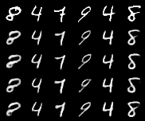
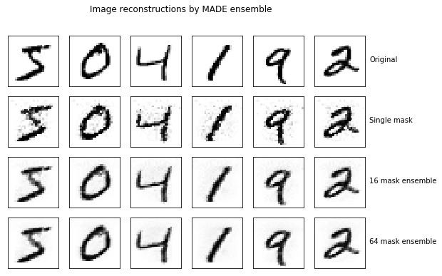

# pytorch Variational Autoencoders
This is a collection of variational autoencoders (or sufficiently related
models) coded in pytorch and available as a Jupyter notebook. The level of
detail available between notebooks varies, but links are included to the
source for those interested in learning more.

Note: if the notebooks below won't load on github, you can use the [Jupyter nb viewer](https://nbviewer.jupyter.org/) instead.
## Basic Variational Autoencoder

[VAE Notebook](./Basic_VAE.ipynb)

Image Reconstructions of MNIST

Image Generation using sampling of latent space

## MADE (Masked Autoencoders for Distribution Estimation)

[MADE Notebook](./MADE.ipynb)

Image reconstruction of MNIST using an ensemble of masks

