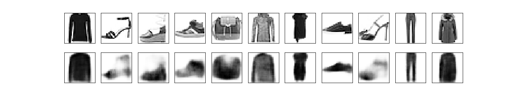

# Variational Autoencoders
Implementation of Variational Autoencoders in pytorch. This is a work in progress.
The long term goal is to have examples of different kinds of VAEs.

## Basic Variational Autoencoder

[VAE Notebook](./Basic_VAE.ipynb)

Image Reconstructions of FashionMNIST

Image Generation using sampling of latent space

