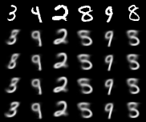
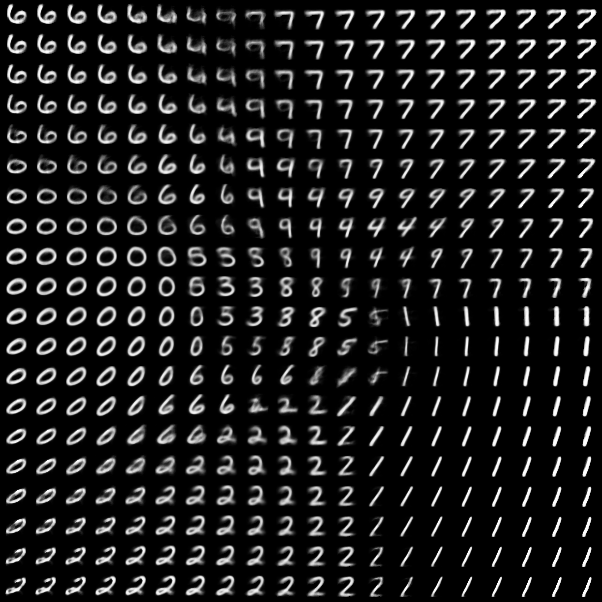

# Pytorch Notebook Examples
This is a collection of Jupyter notebooks for image generation topics
written in pytorch. This git currently includes notebooks on
- [Basic VAE](#Basic%20Variational%20Autoencoder)
- [Lagrangian VAE](#Lagrangian%20VAE)
- [MADE](#MADE)

The level of explanation provided between notebooks varies. Links are included
within the notebooks to sources for those interested in learning more. The
notebooks are listed in reverse chronological order. The pictures below are
generated by the model after training. They all feature MNIST images at the
moment for comparative purposes.

Note: if the notebooks below won't load on github, you can load them using the
[Jupyter nb viewer](https://nbviewer.jupyter.org/) or run them locally instead.

## Setup
If you want to run these notebooks on your own computer, then the easiest way
is to install [conda](https://www.anaconda.com/distribution/), and use the
following commands after cloning this repository:
```
conda env create -f environment.yaml
conda activate pytorch
jupyter notebook
```
This will open a browser window that can be used to load the notebook files.

**Note:** The environment created will be quite large. It will take some time
to create.

**Also:** If you are not going to run this on a GPU, then add the `cpuonly` package to the environment.yaml file. This will reduce the environment size as
it will skip installing the CUDA libraries.

## Lagrangian VAE

The Lagrangian VAE is a Variational Autoencoder that optimizes the
Lagrangian dual equation to provide both consistency and meaningful encodings.

[Lagrangian VAE Notebook (draft)](./Lagrangian_VAE.ipynb)

Image reconstruction of MNIST. It's worth noting how much sharper these images
are as opposed to the basic VAE, even after interjecting noise.


Image reconstruction using sampling of latent space. These images are not as
sharp, but I don't know how to fix that.


Distribution of encoded means. While not conclusive, this seems to
suggest that the model learns to group similar observations near eachother.


## MADE

Masked Autoencoders for Distribution Estimation (MADE) is an autoencoder that
uses masks to provide an autoregressive property. The use of multiple masks
effectively give us one set of parameters that can be used to form an ensemble.

[MADE Notebook](./MADE.ipynb)

Image reconstruction of MNIST using an ensemble of masks.


## Basic Variational Autoencoder

A Variational Autoencoder is a type of deep generative model. Below we can see
some example image reconstructions.

[VAE Notebook](./Basic_VAE.ipynb)

Image Reconstructions of MNIST



Image Generation using sampling of latent space


